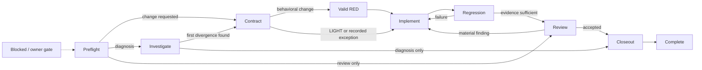

# EpisClaw Engineering Harness

Produce the smallest correct change with evidence proportional to risk. Preserve the user's intent and authority: explicit user instructions take precedence over this workflow, while irreversible or external mutations still require the authority appropriate to the host environment.

This is a governance and verification skill, not a sandbox or deployment engine. A checklist entry is not proof; record the command, artifact, durable observation, or owner decision that supports it.

## 1. Resolve the skill root

Treat the directory containing this `SKILL.md` as `<skill-root>`. Resolve helper paths from it; do not assume the project working directory contains `scripts/`.

Examples:

```text
python "<skill-root>/scripts/git_snapshot.py" --repo . --json
python "<skill-root>/scripts/mission_graph.py" mermaid --tier high
```

Helpers are optional. When Python is unavailable, perform the same checks with native project tools and report that helper automation was not used.

## 2. Choose a risk tier before choosing a mode

Read [references/RISK_TIERS.md](references/RISK_TIERS.md) and select exactly one tier:

- **LIGHT** — reversible docs, presentation, metadata, or narrow configuration work with low blast radius.
- **STANDARD** — ordinary feature, bug fix, or refactor with bounded production impact.
- **HIGH** — security, identity, concurrency, durable state, migrations, external effects, production incidents, or architecture authority.

Escalate when evidence reveals more risk. Do not downgrade merely to avoid a gate. Use the lowest tier that covers the actual failure modes.

## 3. Select the primary mode

- **PREFLIGHT** — map current truth; do not implement unless implementation is authorized.
- **IMPLEMENT** — deliver an authorized bounded change.
- **RCA** — diagnose a reproducible or evidence-backed failure to its earliest responsible divergence.
- **REVIEW** — inspect a report, plan, diff, or claim without silently implementing.
- **CLOSEOUT** — verify, review, record evidence, and hand off; add no unrelated feature work.

A mission may transition between modes. Record why each transition occurs instead of pretending the whole mission stayed in one mode.

## 4. Follow the mission graph



Read [references/OPERATING_GRAPH.md](references/OPERATING_GRAPH.md) for edge conditions, review loops, stop states, and tier-specific gates. `scripts/mission_graph.py` validates graph structure; it does not prove that an evidence claim is true.

### Make long work context-resilient

Read [references/CONTEXT_RESILIENCE.md](references/CONTEXT_RESILIENCE.md) when work is long-running, tool-heavy, handed off, resumed, or likely to cross context compaction. STANDARD and HIGH missions in those conditions must persist a compact mission capsule and repository-bound checkpoint outside the working tree.

After compaction, restart, or handoff, run mission `resume` verification before another mutation. A matching checkpoint permits continuation at the recorded graph node; missing, incomplete, or stale state returns the mission to PREFLIGHT. Revision conflicts must be reconciled rather than blindly retried.

## 5. Establish descriptive and normative truth

Read [references/TRUTH_AND_AUTHORITY.md](references/TRUTH_AND_AUTHORITY.md).

- **Descriptive truth** establishes what exists or happened: current source, tests, runtime observations, durable records, deployed artifacts.
- **Normative truth** establishes what should happen: explicit user requirements, approved product/API contracts, security policy, regulation, and accepted architecture decisions.

Never silently resolve a conflict by declaring either code or documentation universally authoritative. Classify the evidence, identify the owner of the decision, and report the conflict.

Capture the starting repository state before editing. Recommended helper:

```text
python "<skill-root>/scripts/git_snapshot.py" --repo . --json
```

## 6. Freeze a compact change contract

For STANDARD and HIGH work, record:

- requested or failing behavior;
- normative authority and current descriptive path;
- earliest known divergence or open hypothesis;
- intended responsible seam;
- invariants to preserve;
- in-scope and out-of-scope paths/behaviors;
- required proof;
- owner gates still closed.

For RCA, read [references/RCA_PROTOCOL.md](references/RCA_PROTOCOL.md). For scope and mutation authority, read [references/SCOPE_AND_OWNER_GATES.md](references/SCOPE_AND_OWNER_GATES.md).

## 7. Patch the responsible seam

Prefer the earliest seam that owns the behavior and can express the change without inventing a second authority. "Smallest" means the smallest coherent ownership boundary, not the fewest lines.

Reject patches that duplicate authority, hide a wrong state downstream, infer external success from an attempt, or turn an incident into an unrelated redesign. A cross-cutting invariant may legitimately require several coordinated edits; justify each edge in the scope graph.

## 8. Apply proportional RED→GREEN

Read [references/TDD_PROTOCOL.md](references/TDD_PROTOCOL.md) when production behavior changes.

- **LIGHT:** use the cheapest meaningful verification; a behavioral RED is optional unless the change fixes behavior.
- **STANDARD:** require a valid behavioral RED for bug fixes and behavior changes when practical.
- **HIGH:** require deterministic RED→GREEN or a written, evidence-backed exception explaining why reproduction is unsafe or impossible.

A valid RED must fail for the intended behavior at or through the responsible seam. Harness errors, bad fixtures, and unrelated flakes are not RED evidence. After GREEN, run focused and adjacent preservation checks before widening regression.

## 9. Add domain gates only when relevant

- For races, cancellation, retries, callbacks, queues, or external effects, read [references/CONCURRENCY_AND_IDEMPOTENCY.md](references/CONCURRENCY_AND_IDEMPOTENCY.md).
- For identity, authority, secrets, untrusted input, tenant boundaries, or customer-facing output, read [references/SECURITY_CHECKLIST.md](references/SECURITY_CHECKLIST.md).
- For adapters/product surfaces, use [references/CAPABILITY_MATRIX_TEMPLATE.md](references/CAPABILITY_MATRIX_TEMPLATE.md).
- For EpisClaw only, read [references/EPISCLAW_INVARIANTS.md](references/EPISCLAW_INVARIANTS.md). Do not apply EpisClaw Graph, EffectPlane, Multi-Run, channel, or provider constraints to unrelated repositories.

## 10. Guard scope with an explicit baseline and policy

Inspect the full mission diff, including committed branch changes and untracked files. Recommended helper:

```text
python "<skill-root>/scripts/diff_scope_guard.py" --repo . --base <review-base> --allow <path> --forbid <path>
```

The helper returns `UNCONFIGURED` when no allow/forbid policy is supplied unless `--report-only` is explicit. Treat that as a report, not a passed guard.

Stop and re-justify unexpected changes to authentication, production configuration, migrations, dependency roots, unrelated subsystems, or frozen architecture. Passing tests does not justify unexplained scope.

## 11. Run the tier-appropriate regression ladder

- **LIGHT:** focused check plus formatting/build check if affected.
- **STANDARD:** focused regression, adjacent suite, and relevant build/type/lint/static checks.
- **HIGH:** STANDARD plus integration, deterministic concurrency/stress, security/authority review, frozen/golden suites, migration/rollback proof, and race tooling when available.

Use project-native commands from [references/PROJECT_PROFILE_TEMPLATE.md](references/PROJECT_PROFILE_TEMPLATE.md). Do not invent a command or claim a gate passed because the project lacks one.

## 12. Review adversarially and close findings deliberately

Read [references/REVIEW_PROTOCOL.md](references/REVIEW_PROTOCOL.md) for STANDARD or HIGH changes.

- HIGH requires an independent read-only review when the environment and user-authorized workflow permit it.
- STANDARD uses independent or self-review proportional to impact.
- LIGHT normally uses diff inspection and focused verification.

Closure requires `BLOCKER = 0`. Every `SHOULD-FIX` must be fixed, rejected with technical evidence, accepted by the appropriate owner, or explicitly deferred with risk and follow-up. Do not force an artificial zero by relabeling findings.

## 13. Keep claims no stronger than proof

Read [references/PROOF_AND_CLAIMS.md](references/PROOF_AND_CLAIMS.md). Preserve these distinctions:

`SOURCE-VERIFIED` != `TEST-VERIFIED` != `RUNTIME-VERIFIED` != `DEPLOYED-VERIFIED`

An external attempt is not a committed effect. A file path is not delivery. Configuration is not health. A JSONL ledger is not proof unless its referenced commands/artifacts are independently available.

Optional evidence ledger; prefer a durable path outside the working tree as described in the context-resilience reference:

```text
python "<skill-root>/scripts/evidence_ledger.py" init <ledger-path> --mission-id <id>
python "<skill-root>/scripts/evidence_ledger.py" add <ledger-path> --kind red --status fail --command "<focused test>" --exit-code 1 --note "Expected behavioral RED"
python "<skill-root>/scripts/evidence_ledger.py" verify <ledger-path>
```

## 14. Close out proportionally

Use [references/REPORT_TEMPLATE.md](references/REPORT_TEMPLATE.md): compact fields for LIGHT, the standard record for STANDARD, and the complete evidence pack for HIGH.

Before a local commit, run `git diff --check` plus the required project gates. Do not push, deploy, restart, or mutate production state unless the current user instruction and host policy authorize that action.

For changes to this harness itself, follow [references/EVAL_PROTOCOL.md](references/EVAL_PROTOCOL.md): validate structure, run script tests, and evaluate realistic trigger/behavior scenarios before claiming the harness is generalized.

For repository-scoped setup and packaging, use [references/INSTALL.md](references/INSTALL.md).

For design rationale and the dated upstream comparison, see [references/COMPARATIVE_RESEARCH.md](references/COMPARATIVE_RESEARCH.md). Treat the matrix as an architectural assessment, not behavioral benchmark evidence.
