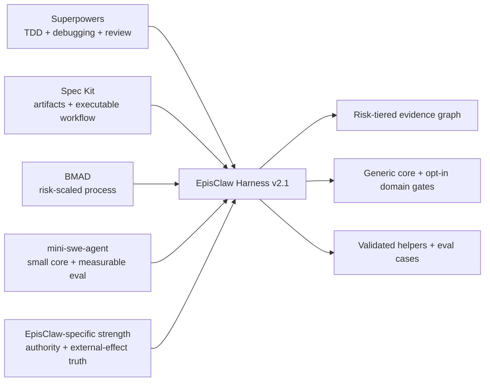

# Comparative Research Baseline

Research checked on 2026-09-04. Recheck upstream before making time-sensitive claims.

## Reference systems

- [obra/superpowers](https://github.com/obra/superpowers) supplies strong TDD, systematic debugging, verification-before-completion, two-stage review, and skill-testing patterns.
- [github/spec-kit](https://github.com/github/spec-kit) supplies durable specification artifacts, agent integrations, scripts, presets, extensions, and executable workflows with conditions, loops, fan-out/fan-in, pause, and resume.
- [bmad-code-org/BMAD-METHOD](https://github.com/bmad-code-org/BMAD-METHOD) supplies scale-adaptive planning depth, structured lifecycle workflows, and specialist roles.
- [SWE-agent/mini-swe-agent](https://github.com/SWE-agent/mini-swe-agent) demonstrates that a small runtime/tool loop plus serious benchmark discipline can outperform a much larger prompt surface.

These projects are not identical competitors. Superpowers, Spec Kit, and BMAD are process systems; mini-swe-agent is primarily an execution harness. Compare the design dimension, not just repository size or popularity.

## What this harness deliberately combines

## Architectural comparison

Ratings are `weak`, `basic`, `strong`, or `leading` for the named dimension. They are reasoned design assessments, not results from a common benchmark.

| Dimension | Harness v2.1 | Superpowers | Spec Kit | BMAD | mini-swe-agent |
|---|---|---|---|---|---|
| Evidence/claim discipline | Leading | Strong | Strong | Basic–strong | Benchmark-oriented |
| External-effect and authority semantics | Leading | Basic | Basic–strong | Basic | Basic |
| TDD/debug/review pedagogy | Strong | Leading | Strong through gates | Strong | Runtime-dependent |
| Risk proportionality | Strong | Basic; workflows are intentionally strict | Strong through optional gates/presets | Leading | Minimal process |
| Executable orchestration | Basic–strong; local state graph and helpers | Strong skill workflow | Leading workflow engine | Leading lifecycle tooling | Leading for a small agent loop |
| Cross-agent packaging/integration | Basic | Strong | Leading | Strong | Runtime-specific |
| Behavioral evaluation maturity | Basic; cases exist, trials not bundled | Strong skill-test infrastructure | Strong project tests/workflow validation | Project-dependent | Leading benchmark orientation |
| Domain isolation | Strong after v2 split | Strong modular skills | Strong extensions/presets | Strong modules | Small core |

## Where v2.1 is genuinely better

1. It explicitly separates descriptive truth from normative authority. Current code can describe reality without being allowed to redefine the contract.
2. It treats attempted, acknowledged, committed, ambiguous, and externally verified outcomes as different states. This blocks common delivery and payment-style claim upgrades.
3. It makes owner/mutation authority, idempotency, cancellation, and partial external effects first-class gates rather than optional review notes.
4. It gives LIGHT/STANDARD/HIGH paths through one state graph, so a typo does not inherit production-incident ceremony.
5. EpisClaw invariants are opt-in instead of contaminating the portable core.
6. Long missions can persist a compact contract, bind it to repository/evidence fingerprints, fence concurrent writers by revision, and fail back to PREFLIGHT on stale resume.

## Where v2.1 remains behind

1. It has no installer/registry adapters for many agent families. Spec Kit is materially ahead here.
2. Its mission graph validates transitions but does not execute project commands, evaluate evidence truth, or orchestrate fan-out. It is not a workflow engine.
3. The eleven packaged eval cases and result summarizer are specifications/infrastructure, not multi-model trial results. Superpowers and mini-swe-agent have stronger public evaluation machinery.
4. Helpers use Python only. Python is optional by policy, but there are no behaviorally equivalent PowerShell/POSIX implementations.
5. There is no CI workflow, signed release process, telemetry, adoption evidence, or public license in this bundle.

## Honest position

The v2 harness is unusually strong as a compact governance layer for high-risk engineering, especially where external truth and authority matter. It is not yet a universal engineering platform. Apply the generic core broadly, activate domain gates conditionally, and prefer a lighter project-native workflow when the repository already has equivalent controls.
