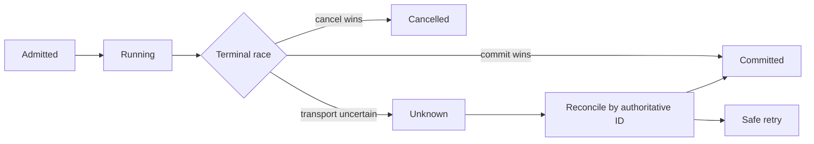

# Concurrency, Cancellation, Retry, and Idempotency Checklist

Model the operation as a graph when work fans out, joins, retries, or crosses an external boundary. Name each state node and the event that authorizes each edge; a happy-path sequence alone cannot expose competing terminal claims.

## Linearization

For every concurrent state transition, identify the moment after which the outcome is authoritative.

Examples:

- cancel/stop vs final send;
- callback duplicate vs first execution;
- active-version snapshot vs concurrent activation;
- queue admission vs purge;
- external send part 1 vs part 2 failure.

If no linearization point can be named, the implementation is not ready.

For fan-out/join work, identify whether the join observes all children, first success, quorum, or bounded partial completion. Ensure late children cannot overwrite an already authoritative terminal state.

## Cancellation

Test:

- cancellation before admission;
- cancellation while queued/waiting semaphore;
- cancellation during streaming;
- cancellation immediately before terminal claim;
- next turn unaffected by prior stop;
- restart/resume does not resurrect canceled work when durable semantics say canceled.

## Idempotency

Stable provider/request identities may be used at the provider/idempotency boundary but must not become core authority.

Test:

- duplicate ingress;
- duplicate callback;
- provider retry;
- local retry after timeout;
- stale completion;
- duplicate timer/queue release.

## External outcomes

Separate:

- attempt accepted locally;
- provider request sent;
- provider acknowledged with authoritative identity;
- external effect committed;
- partial/ambiguous outcome.

When reality is ambiguous or partially committed, prefer `UNKNOWN` over fabricated success/failure.

Never blindly resend after an ambiguous transport outcome if doing so can duplicate an external effect.

Persist an idempotency identity before the external attempt when the provider contract requires the same identity across retries. Do not generate a new identity after an ambiguous outcome.

## Timeouts

Bound external/backend probes and waits. Timeout is a state, not authority to fall back to a weaker credential/policy/delivery path.

## Required adversarial schedule

For STANDARD/HIGH concurrent work, cover at least the plausible pairs among cancel/finalize, retry/acknowledge, activate/read, enqueue/purge, and duplicate callback/first execution. Use a race detector, deterministic scheduler, synchronization hooks, or repeated stress only when it materially exercises the contested edge; repetition alone is weak evidence.
