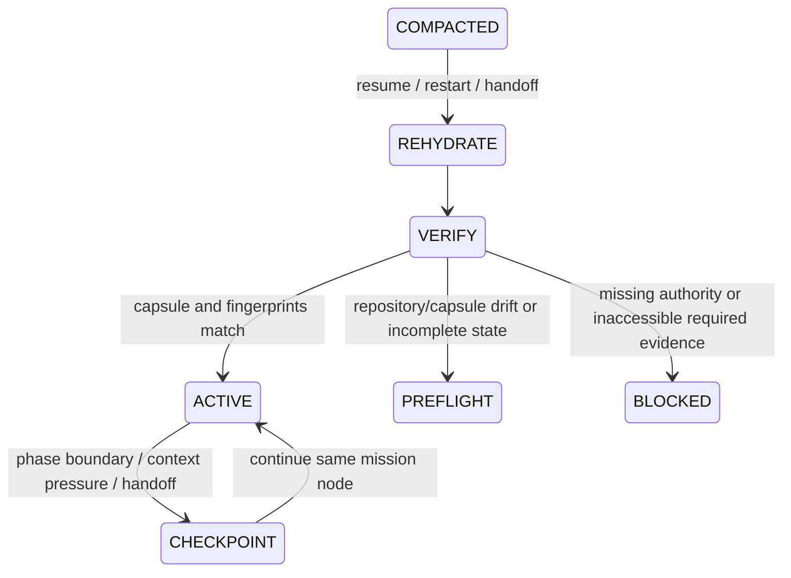

# Context Resilience and Mission Rehydration

Use this protocol when a mission is long-running, tool-heavy, handed off, resumed after interruption, or likely to cross a model-context compaction boundary. For HIGH work, use it whenever durable mission state affects correctness or authority.

Compaction is an expected runtime event, not an exceptional failure. Conversation history is working memory; it is not the durable authority for scope, owner decisions, repository truth, or proof.

## Three distinct artifacts

- **Mission capsule** — the latest compact contract and decision state required to continue safely.
- **Checkpoint** — a binding between the capsule, mission graph node, repository fingerprint, and optional evidence-ledger fingerprint.
- **Evidence ledger** — a best-effort-redacted, self-consistency-checked index of claims and proof pointers. It is not the underlying proof or an authenticated audit log.

Do not copy raw secrets, private reasoning, full tool output, or customer-sensitive payloads into any of these artifacts.

## Durability sidecar graph

Checkpoint and rehydration are cross-cutting guards; they do not replace canonical mission states or satisfy their edge conditions.



A successful checkpoint does not prove RED, GREEN, review acceptance, deployment, or an external effect. It only proves that a structurally complete continuation record was persisted.

## Mission capsule

Keep the capsule current rather than appending a chat transcript. It contains:

- requested behavior;
- normative authority and descriptive truth;
- divergence or open hypothesis;
- responsible seam;
- invariants;
- in-scope and out-of-scope paths/behaviors;
- required proof;
- owner gates;
- decisions and rejected alternatives;
- open findings;
- next safe action.

STANDARD and HIGH checkpoints reject an incomplete capsule unless `--allow-incomplete` records a deliberate preflight exception. Use explicit values such as `none identified` rather than omitting a field that was considered.

## Durable placement

Prefer automatic placement outside the working tree:

```text
python "<skill-root>/scripts/mission_graph.py" init --repo <repo> --tier high --mission-id <id> --context-file <capsule.json>
```

For a Git repository, the helper stores the mission beneath the repository Git directory. For a non-Git workspace, it uses the current user's platform state directory keyed by the absolute workspace path. Use `locate` to inspect the resolved path without creating it:

```text
python "<skill-root>/scripts/mission_graph.py" locate --repo <repo> --mission-id <id> --json
```

An explicit mission path remains supported for compatibility. Do not assume a `.gitignore` inside the skill folder ignores artifacts created at the target repository root.

## Checkpoint cadence

Checkpoint:

- after the change contract is frozen;
- after valid RED and focused GREEN;
- after regression and review findings change;
- before a tool-heavy phase, handoff, or expected interruption;
- after any owner decision that changes scope, authority, or accepted risk;
- before CLOSEOUT for STANDARD/HIGH missions.

Example:

```text
python "<skill-root>/scripts/mission_graph.py" checkpoint <mission-path> --repo <repo> --context-file <capsule.json> --ledger <ledger-path> --evidence <proof-reference> --expected-revision <n>
```

Use `--allow-non-git` only after deliberately accepting a recursive filesystem fingerprint of the named root. STANDARD/HIGH missions without a repository require the explicit `--allow-no-repo` exception.

## Revision and writer safety

The mission revision is the compare-and-swap boundary. Every mutating helper operation holds an OS-backed byte-range/advisory lock and replaces state using a flushed temporary file plus write-through replacement or parent-directory synchronization. The lock file may persist, but lock ownership exists only while the process holds the OS lock; it is never reclaimed by unlinking a stale pathname. Pass `--expected-revision` when another worker, agent, callback, or resumed process could hold stale state. Filesystem durability still depends on the host filesystem honoring its synchronization primitives.

On a revision conflict:

1. do not retry the same transition blindly;
2. reload mission status;
3. reconcile the other writer's evidence and repository state;
4. return to PREFLIGHT if the responsible seam, contract, or proof requirements changed.

The lock prevents concurrent writes from losing history. It does not make two contradictory decisions semantically compatible.

## Resume procedure

After compaction, restart, or handoff:

```text
python "<skill-root>/scripts/mission_graph.py" resume <mission-path> --repo <repo> --ledger <ledger-path>
```

The helper returns:

- `RESUME_ALLOWED` with exit code `0` when the capsule and persisted fingerprints match;
- `PREFLIGHT_REQUIRED` with exit code `3` when the checkpoint is absent, incomplete, stale, or mismatched;
- an operational error with exit code `1` when the mission cannot be parsed or verified.

When resume is allowed, independently read the referenced contract and proof artifacts before mutating code. When PREFLIGHT is required, preserve the current worktree, capture a new descriptive snapshot, reconcile the capsule, and create a fresh checkpoint. Never force a stale checkpoint green by editing its stored fingerprint.

## Fingerprint boundary

For Git repositories, the checkpoint binds:

- repository root;
- HEAD;
- branch;
- index entries and index intent flags;
- the actual mode, symlink target, and bytes of every tracked working-tree path, independent of `skip-worktree` or `assume-unchanged` status filtering;
- recursive submodule status;
- untracked paths and content hashes.

Required Git fingerprint commands fail closed. An operational Git error does not become an empty diff or an allowed resume.

For explicit non-Git mode, it binds a recursive content fingerprint of the named root. The fingerprint detects change; it does not establish who made the change, whether it is correct, or whether it is authorized.

An optional evidence-ledger fingerprint detects ledger changes after the checkpoint. Verify the ledger's own self-consistency chain separately before using its index. Because that chain is unkeyed and has no external anchor, a writer who can rewrite the entire file can also recompute it; it detects unrecomputed edits and corruption, not authorship or hostile replacement.

## Tier policy

- **LIGHT:** checkpoint only when interruption or handoff would create meaningful rework.
- **STANDARD:** checkpoint at contract and before closeout for multi-phase or tool-heavy work.
- **HIGH:** maintain a complete capsule, checkpoint every material graph edge, use expected revisions when more than one writer is plausible, and run resume verification before post-compaction mutation.

## Claim boundary

`RESUME_ALLOWED` means the saved continuation inputs still match. It is not `TEST-VERIFIED`, `RUNTIME-VERIFIED`, or `DEPLOYED-VERIFIED`. Preserve the proof labels established by the underlying commands and artifacts.
