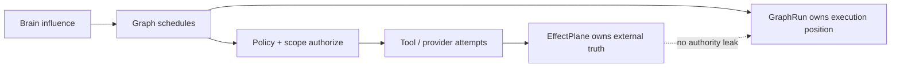

# EpisClaw Frozen Invariants and Source Priority

Use this reference only when the repository is EpisClaw.

## Source of truth

Use this order:

1. Current source code, runtime, tests, durable production evidence.
2. `EPISCLAW_ARCHITECTURE_INDEX.md` and its authoritative architecture pack.
3. Current onboarding/current productization authorities.
4. Historical/legacy material.

If descriptive sources conflict, current verified implementation truth wins. A current implementation does not override a normative contract, security requirement, or explicit owner decision; classify the conflict and report it instead of silently reconciling it.

## Graph foundation

Current generation is **STABILIZED / CLOSED**.

Do not reopen frozen Graph architecture for elegance, abstraction cleanliness, or hypothetical scale. Reopen only for a reproducible production correctness violation.

Current production Graph shape:

- phase-preserving bounded flat DAG;
- not hierarchical/nested/recursive Graph-of-Graphs;
- maximum 12 tasks including Join;
- mission hard tool-call ceiling <= 48.

## Authority principle

Brain may influence.
Graph may schedule.
Policy may authorize.
ONLY EffectPlane may claim external reality.

Preserve distinctions:

- Brain = cognitive relevance / uncertainty / memory influence.
- Graph = scheduling authority.
- Capability = semantic action class.
- Policy + scope = permission.
- Channel/provider = transport/support.
- Tool = implementation.
- EffectPlane = external mutation truth.
- GraphRun = durable execution-position truth only.

Task semantic identity/execution profile determines what a task **is**. Capabilities determine what it **may do**.

Model routing never grants capability or authority. Preserve `FILTER FIRST, RANK SECOND` and the current routing modes unless explicitly authorized otherwise.

## Artifact truth

Preserve:

`artifact exists != artifact QA PASS != externally delivered`

A filename/local path in prose is not delivery.

Repair is bounded, creates a new revision, preserves failed historical revisions, and never fabricates content to force QA green.

External delivery truth belongs only to EffectPlane.

## Channels

Slack is a reference implementation, not architecture authority.

Core semantics must remain channel-agnostic. Provider-specific replies, topics, rendering, streaming, uploads, native buttons, retries, and transport behavior remain downstream.

Do not create provider-specific Graph/TaskPlan/EffectPlane/ModelPolicy copies.

## Stop and Multi-Run

Current `/stop` is durable and proven but session-level.

Exact thread/run ControlTarget is not automatically available.

Multi-Run conversation runtime is not implemented unless current source proves otherwise and remains owner-gated.

Do not smuggle Multi-Run through provider topic/thread identities.

## Web/product

Customer Web and operator/engineering console are different product surfaces.

Customer UI should consume typed product truth, not reconstruct business truth from raw runtime/tool/model events.

Never expose raw chain-of-thought, prompts, raw tool args/results, secrets, internal routing, Graph compiler internals, database tables, env names, crypto internals, or filesystem paths in customer surfaces.

## Owner gates

Never assume authorization to:

- push origin;
- implement Multi-Run;
- implement Web;
- enable risky runtime gates;
- change production secrets;
- broadly refactor frozen architecture;
- add hierarchical Graph;
- roll out a new provider/channel;
- deploy/restart production.
