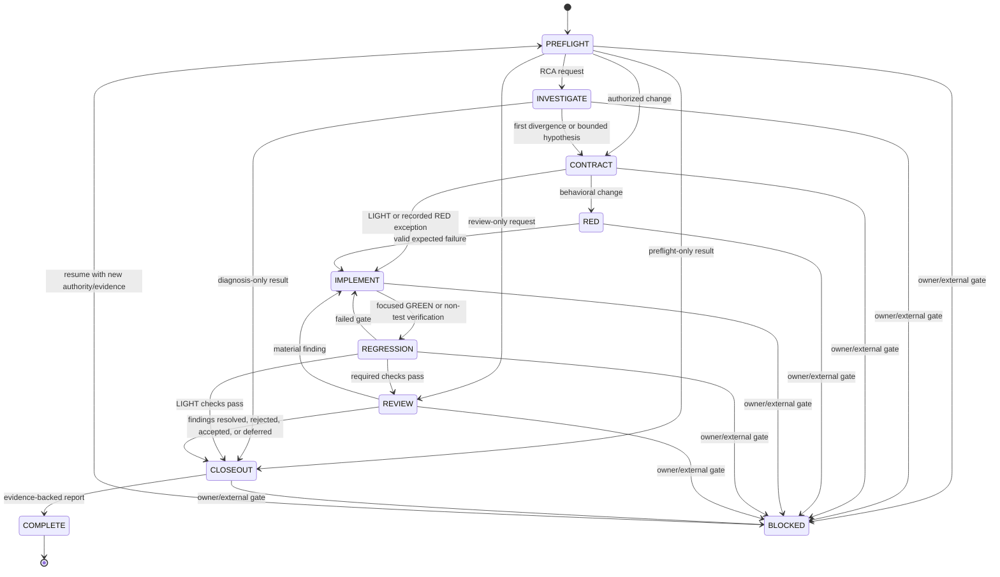

# Operating Graph

The mission is a state graph, not a fixed checklist. Edges are taken only when their evidence condition is satisfied.

## Canonical graph

## Edge conditions

| From | To | Minimum evidence |
|---|---|---|
| PREFLIGHT | CONTRACT | tier, scope, descriptive/normative truth, authorization |
| PREFLIGHT | INVESTIGATE | failure/symptom and available evidence identifiers |
| PREFLIGHT | REVIEW | review target and comparison authority |
| INVESTIGATE | CONTRACT | first divergence or explicit unresolved hypothesis |
| CONTRACT | RED | expected invariant and responsible seam |
| CONTRACT | IMPLEMENT | LIGHT classification or RED exception |
| RED | IMPLEMENT | test failed for the intended behavioral reason |
| IMPLEMENT | REGRESSION | focused proof is green or applicable non-test verification passed |
| REGRESSION | REVIEW | tier-required checks completed; limitations recorded |
| REGRESSION | CLOSEOUT | LIGHT tier checks completed; limitations recorded |
| REGRESSION | IMPLEMENT | exact failed gate and next bounded correction |
| REVIEW | IMPLEMENT | actionable finding mapped to scope/invariant |
| REVIEW | CLOSEOUT | blockers cleared; other findings dispositioned |
| CLOSEOUT | COMPLETE | report states local/remote/deployed truth without claim upgrades |
| any active state | BLOCKED | exact missing authority, evidence, or external condition |
| BLOCKED | previous state or PREFLIGHT | new authority/evidence; resume exact work or reassess |

## Loops

Loops must produce new evidence:

- `REGRESSION → IMPLEMENT` is allowed only for a named failing gate.
- `REVIEW → IMPLEMENT` is allowed only for a concrete finding.
- Repeated fixes that do not change the evidence should return to INVESTIGATE rather than accumulating patches.

After three failed hypotheses against the same symptom, explicitly reassess the assumed architecture and responsible seam. Do not automatically redesign; surface the decision to the appropriate owner.

## Risk-tier paths

- LIGHT may use `PREFLIGHT → CONTRACT → IMPLEMENT → REGRESSION → CLOSEOUT`.
- STANDARD normally includes RED for behavioral work and REVIEW before CLOSEOUT.
- HIGH uses every applicable node and must not skip REVIEW or the relevant domain gates.
- Review-only work uses `PREFLIGHT → REVIEW → CLOSEOUT` and must not mutate the tree unless the user separately authorizes implementation.

## Persistent state helper

`scripts/mission_graph.py` stores tier, current state, revision, transition history, blocked origin, evidence references, a compact mission capsule, and the latest repository-bound checkpoint. It rejects invalid edges, permits a blocked mission to resume only at its recorded origin or PREFLIGHT, fences concurrent writers by revision, and can render the canonical graph as Mermaid.

It does not inspect whether an evidence reference is true. A structurally valid mission file can still contain false claims; verify the referenced command, artifact, durable record, or owner decision.

Checkpoint and resume are cross-cutting guards rather than canonical mission states. Follow [CONTEXT_RESILIENCE.md](CONTEXT_RESILIENCE.md): a matching checkpoint resumes the recorded state, repository/capsule drift returns to PREFLIGHT, and missing authority remains BLOCKED. Never use checkpoint success as evidence for a mission transition.
