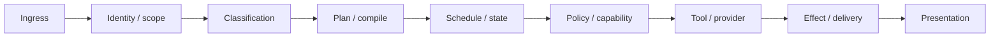

# First-Divergence RCA Protocol

Use this for production bugs, correctness failures, flaky state, performance regressions, wrong external claims, or long event chains.

## Canonical loop

1. Preserve exact identifiers, timestamps, environment, and artifact version.
2. Establish descriptive truth from durable/runtime/source evidence.
3. Establish the normative contract separately.
4. Reproduce deterministically or record why safe reproduction is unavailable.
5. Trace the actual path and mark expected versus observed at each boundary.
6. Identify the earliest boundary that can explain the downstream observations.
7. Form one bounded hypothesis and test one variable.
8. Patch the smallest responsible seam only when implementation is authorized.
9. Add deterministic regression and preserved-behavior coverage.
10. Run tier-appropriate adjacent and frozen checks.
11. Deploy or replay organically only when authorized and materially useful.
12. Verify durable/external truth and stop at the declared condition.

## Divergence graph

Adapt the nodes to the subsystem. Do not force a linear chain when the system is a graph: record fan-out, joins, feedback edges, shared state, and competing writers.

## First-divergence table

| Boundary/node | Inputs and version | Expected | Observed | Evidence | Diverged? |
|---|---|---|---|---|---|
| | | | | | |

For multi-causal incidents, identify the earliest sufficient set of causes rather than inventing one root cause. Distinguish trigger, latent condition, amplification, and detection failure.

## Hypothesis discipline

- State: `I think X causes Y because evidence Z`.
- Change one variable or add one observation point.
- If falsified, return to the graph and create a new hypothesis.
- Do not accumulate patches around an unproven theory.
- After three failed fixes against the same symptom, reassess the assumed architecture with the owner.

## Smells

- renderer hides wrong state instead of fixing its owner;
- retry duplicates calls because outcome classification is wrong;
- channel/provider code copies core semantics;
- UI infers health from configuration;
- tests assert an internal detail while the external contract still fails;
- a cleaner abstraction replaces a working authority without evidence.

A new abstraction is justified only when the current contract cannot be made correct without duplication, contradiction, or an unacceptable failure mode.
