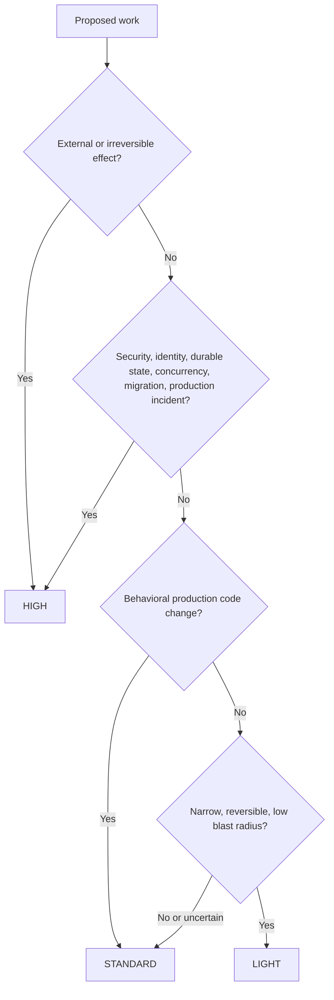

# Risk Tiers

Choose the lowest tier that covers the credible failure modes. Reassess after preflight and whenever scope, data sensitivity, or external effects change.

## Decision graph

## LIGHT

Use for reversible, localized work such as documentation, copy, presentation, metadata, generated artifacts, or narrow configuration where failure is easy to detect and undo.

Minimum gates:

- confirm target and scope;
- inspect relevant current source/config;
- run the cheapest meaningful verification;
- inspect the diff;
- state what was and was not verified.

Escalate when the change affects executable behavior, permissions, secrets, data durability, dependencies with broad reach, or external systems.

## STANDARD

Use for ordinary features, bug fixes, and refactors with bounded impact.

Minimum gates:

- starting repository truth;
- compact change contract;
- behavioral RED for fixes/behavior changes when practical;
- focused GREEN and adjacent preservation checks;
- relevant build/type/lint/static checks;
- scope inspection;
- proportional adversarial review;
- standard closeout record.

## HIGH

Use when failure can cause material security, privacy, financial, availability, data-integrity, tenant-isolation, or external-effect harm.

Triggers include:

- authentication, authorization, identity, secrets, or policy;
- concurrent state transitions, retries, callbacks, queues, or cancellation;
- durable state, schema/data migrations, destructive operations, or recovery;
- payments, messaging, cloud/provider mutation, or other external effects;
- production incidents and deployment correctness;
- frozen architecture or cross-subsystem authority changes.

Minimum gates:

- explicit descriptive/normative truth map;
- first-divergence RCA or bounded design rationale;
- deterministic RED→GREEN or recorded exception;
- security/authority and concurrency/idempotency review as applicable;
- complete regression ladder and environmental limitations;
- configured scope guard against an explicit baseline;
- independent review when permitted and available;
- complete evidence pack and owner-gate truth.

## Escalation and de-escalation

Escalation is immediate when a higher-tier trigger appears. De-escalation requires evidence that the trigger is absent or isolated outside the changed path; record the reason in the mission ledger or closeout.

Do not use HIGH merely because a task is large. Complexity and risk are related but not identical.
