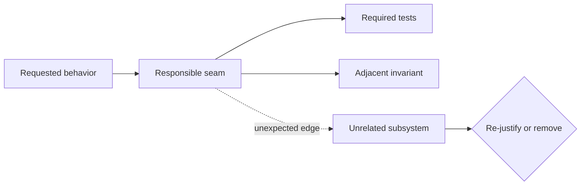

# Scope Discipline and Owner Gates

## Freeze scope

### In scope

- named subsystem/path;
- exact behaviors or artifacts;
- exact tests/proofs;
- permitted external actions, if any.

### Out of scope

- attractive cleanup;
- future milestones;
- unrelated provider/channel work;
- architecture modernization without evidence;
- unrelated config, secret, data, or dependency migration.

## General owner gates

Unless the current user instruction and host policy authorize them, keep these gates closed:

- push, merge, release, publish, or open an external PR;
- deploy, restart, or mutate a live environment;
- change production secrets, credentials, configuration, or data;
- execute destructive migrations or irreversible effects;
- contact external people/services beyond the requested workflow;
- expand into a new product surface or provider rollout.

Authorization is action- and scope-specific. General encouragement does not grant unrelated external mutation, while an explicit request to perform a normal in-scope action should not be ignored.

## EpisClaw-only owner gates

Apply these only after confirming the repository or mission is EpisClaw:

- Multi-Run or exact run/thread control;
- customer Web implementation;
- risky runtime-gate enablement;
- broad frozen Graph refactor or hierarchical Graph;
- new provider/channel rollout;
- production credential migration.

## Scope graph

Model changed roots and their ownership edges:

Pause when production code crosses an unexpected ownership edge. A larger patch may be correct, but each edge must be required by the invariant rather than convenience.

## Expansion tripwires

- provider fix changes frozen core semantics;
- local bug becomes multiple migrations;
- test correction rewrites golden behavior;
- dependency upgrade touches broad unrelated code;
- mission starts implementing a future milestone;
- new auth/tenant behavior appears without an authority decision.

Record deferred findings instead of silently absorbing them into the current mission.
