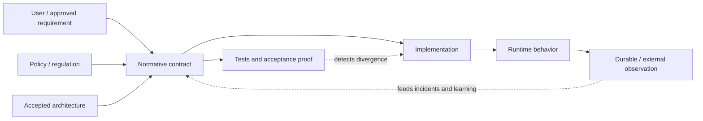

# Truth and Authority Model

## Two truth planes

### Descriptive truth

Descriptive evidence answers what exists, executed, or happened.

Typical precedence within the same environment and time window:

1. durable external/system-of-record observation;
2. exact deployed artifact and runtime observation;
3. current source and configuration actually used;
4. deterministic tests in their stated environment;
5. architecture/history documents as descriptions.

This order is contextual. A local source checkout does not outrank the exact deployed artifact when describing production.

### Normative truth

Normative authority answers what should happen.

Possible sources include:

- explicit current user requirement;
- approved product or API contract;
- security/privacy policy and regulation;
- accepted architecture decision or invariant;
- compatibility promise;
- approved change contract for the mission.

Code and tests may implement normative truth, but their existence alone does not make the behavior correct.

## Conflict procedure

When sources disagree:

1. identify whether each source is descriptive or normative;
2. bind it to an environment, version, owner, and time when possible;
3. state the conflict without silently choosing a winner;
4. determine who owns the normative decision;
5. preserve current descriptive evidence before changing it;
6. update source, tests, and maintained documentation together when authorized.

If the normative owner is unknown, continue with read-only diagnosis and reversible preparation. Do not invent product, legal, security, or production authority.

## Authority graph

No arrow grants mutation authority. Deployment, external messaging, secret changes, and destructive data operations remain separate owner gates.
